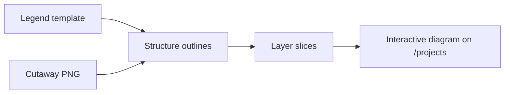

# Lung cutaway layers — user guide

**Audience:** Lab members, content reviewers, and anyone approving the interactive lung visualization — not developers.

**Technical counterpart:** [`.cursor/agents/lung-cutaway-layers.md`](.cursor/agents/lung-cutaway-layers.md) (Cursor agent instructions for implementation).

---

## What this work is for

The Milad Lab site includes an interactive research illustration on the **Projects** page. A person stands outdoors in Ottawa; visitors click one of five exposure pathways (cannabis, cigarette smoke, air pollution, vaping, or viruses). The scene zooms into a **shared lung and airway cutaway** — the same diagram for every pathway — and the view highlights the cells and structures that pathway’s research focuses on.

This guide explains the **layer agent**: the specialized assistant that turns a finished scientific illustration plus its legend into that interactive, clickable diagram.

When the agent succeeds, you get a diagram that:

- Keeps the **original artwork** at full quality (nothing is redrawn or replaced).
- Lets visitors **click a pathway** and see **only the relevant anatomy light up** on the same cutaway.
- Grounds every highlight in **real lab research** already on the site — starting with **cannabis and respiratory health**.

---

## The two inputs

| Input | What it is | File |
|-------|------------|------|
| **Cutaway artwork** | The neutral lung/airway schematic shown after the outdoor zoom | `public/figures/lung-health/cutaway-neutral.png` |
| **Legend template** | A labeled reference sheet that names each structure and which exposure pathways it belongs to | `public/figures/lung-health/Lung Cutaway Legend Template.png` |

The legend is the **map**. The cutaway PNG is the **picture**. The agent’s job is to connect them: every named region in the legend must correspond to a precise outline on the artwork so the site can highlight it independently.

---

## What “success” looks like (cannabis first)

Phase 3 of the visualization builds **one pathway state fully first** — cannabis — as the template before the other four. When the layer agent has done its job for cannabis, a visitor on `/projects` can:

1. Hover the **cannabis** bubble on the Ottawa scene and read the program preview.
2. Click it, watch the zoom into the shared cutaway, and see the caption panel open with the cannabis research framing.
3. On the cutaway itself, **two structures illuminate** while the rest of the anatomy stays visible but de-emphasized:
   - **Airway epithelium** — the ciliated lining of the airway lumen (where inhaled exposure first meets the lung).
   - **Antiviral immune mediators** — antibodies and signaling elements in the upper airway inset (where cannabis-related work examines weakened antiviral defense).

Those highlights match the lab’s published framing: cannabis smoke exposure can suppress antiviral immune responses in the lung, with related cohort work on dried cannabis use, tobacco co-use, and respiratory infection risk.

The same cutaway and the same agent workflow later support the other pathways — cigarette smoke (neutrophils, macrophages, inflammatory signaling), air pollution (COPD-relevant structures), vaping (dendritic cells, immune compartment), and viruses (infection/antiviral pathway) — without creating five separate illustrations.

---

## How the agent turns image + legend into interactivity

In plain terms, the agent performs four steps:

1. **Read the legend** — Confirm each structure name, its appearance, and which pathway(s) it belongs to.
2. **Trace outlines on the artwork** — Draw invisible boundaries around each structure on the cutaway PNG (in pixel coordinates, at native 1024×953 resolution). These outlines are stored in the feature database, not guessed from memory.
3. **Slice the image into layers** — A build step cuts the PNG along those boundaries so each structure can be shown, hidden, or dimmed on its own while the full illustration still looks identical when everything is visible.
4. **Wire highlights to pathways** — When cannabis is active, only cannabis-linked layers brighten; inactive research structures fade. The visitor always sees the original figure — highlights are overlays, not a replacement drawing.

The agent validates its work: sample points inside each structure must fall within the traced outline, and reassembling all layers must match the source PNG pixel-for-pixel.

---

## What stays visible vs. what lights up

**Always visible (base anatomy)** — the full cutaway PNG underlies everything:

- Trachea / conducting airway  
- Bronchial branches  
- Alveolar fields  
- Airway lumen (inset)

**Pathway highlights (toggled per click)** — nine research-focused structures, including for cannabis:

| Pathway | Structures that light up |
|---------|--------------------------|
| **Cannabis** *(template)* | Airway epithelium, antiviral immune mediators |
| Cigarette smoke | Neutrophils, alveolar macrophages, inflammatory signaling |
| Air pollution | COPD-relevant inflammatory structures |
| Vaping | Dendritic cells, airway immune compartment |
| Viruses | Infection / antiviral pathway |

---

## What the agent will *not* do

- **Replace the artwork** with a simplified SVG or AI redraw. The published figure must remain the source of truth.
- **Invent biology** not supported by site content or papers you have approved.
- **Batch all five pathways** before cannabis is reviewed and signed off.
- **Expose build mechanics** on the live site (no “generated from,” npm commands, or maintainer notes on public pages).

If a legend label and the artwork disagree, the agent should **flag the mismatch** rather than guess coordinates.

---

## How this fits the larger visualization

| Phase | Visitor experience | Layer agent role |
|-------|-------------------|------------------|
| 1 — Done | Outdoor scene; five clickable bubbles | None yet |
| 2 — Done | Zoom from bubble into shared cutaway | Prepares outlines; cutaway shows as one image |
| **3 — In progress** | **Pathway-specific highlights on the cutaway** | **Primary responsibility of this agent** |
| 4 — Planned | “How we study this” methods annotations on the same cutaway | Extends layer system |
| 5 — Planned | Motion polish, accessibility, mobile, publication links | Coordinates with transition agent |

The outdoor zoom and portal transition are owned by a separate agent ([`lung-visual-transition`](.cursor/agents/lung-visual-transition.md)). This layer agent owns everything **inside** the cutaway once the visitor arrives.

---

## Review checklist (for approvers)

Before signing off on the cannabis template state, confirm on `/projects`:

- [ ] The cutaway looks **identical** to the authored PNG — no redrawn anatomy, no missing labels.
- [ ] Clicking **cannabis** highlights **airway epithelium** and **antiviral immune mediators** in sensible locations (lumen inset, upper mediator field).
- [ ] Inactive highlight regions are **dimmed**, not removed — context remains visible.
- [ ] Caption copy matches approved research language from the cannabis respiratory health program.
- [ ] **Back** returns to the outdoor scene; keyboard and reduced-motion behavior still work.
- [ ] You are comfortable using this cannabis state as the **pattern** for cigarette, air, vaping, and viruses.

---

## Related documents

- [`lung-health-visual-brief.md`](lung-health-visual-brief.md) — Overall creative direction and phased roadmap  
- [`lung-health-visual-phase2.md`](lung-health-visual-phase2.md) — Outdoor zoom into the shared cutaway (complete)  
- [`.cursor/agents/lung-cutaway-layers.md`](.cursor/agents/lung-cutaway-layers.md) — Technical agent instructions for Cursor  
- [`.cursor/agents/lung-visual-transition.md`](.cursor/agents/lung-visual-transition.md) — Outdoor scene → cutaway camera transition
